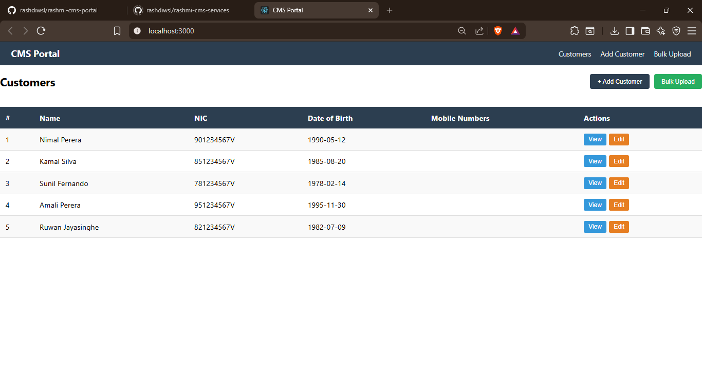
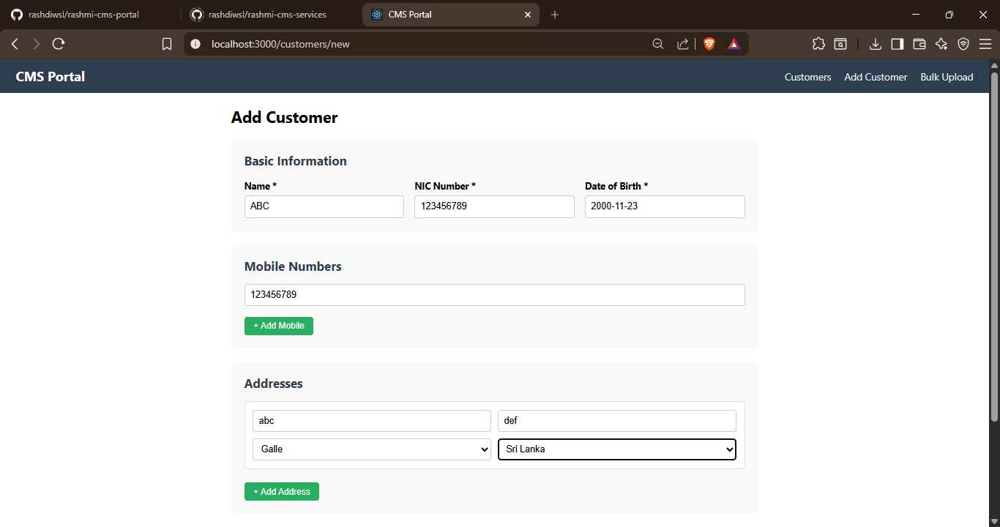
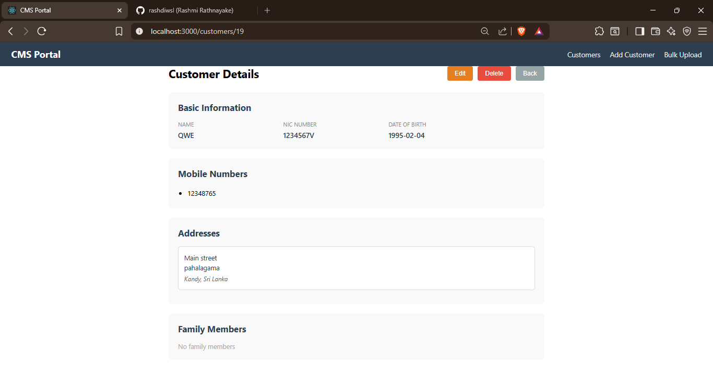
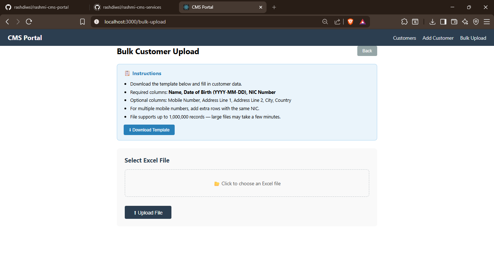

# rashmi-cms-portal

React JS frontend for the Customer Management System.

## Tech Stack
- React 18
- Axios (HTTP client)
- React Router DOM (navigation)
- React DatePicker (date selection)
- Maven (backend build tool)

## Screenshots

### Customer List


### Add Customer


### Bulk Upload


### Bulk Upload


## Prerequisites
- Node.js 16+
- npm 8+
- Backend running at http://localhost:8080

## How to Run
```bash
npm install
npm start
```
App opens at: `http://localhost:3000`

## Pages
| Page | URL | Description |
|------|-----|-------------|
| Customer List | / | View all customers in table |
| Add Customer | /customers/new | Create new customer |
| Edit Customer | /customers/edit/:id | Update existing customer |
| View Customer | /customers/:id | View customer details |
| Bulk Upload | /bulk-upload | Upload Excel file |

## Features
- ✅ Create, Read, Update, Delete customers
- ✅ Date picker for date of birth
- ✅ Multiple mobile numbers per customer
- ✅ Multiple addresses with city/country dropdowns
- ✅ Family member linking (customers linked to customers)
- ✅ Bulk customer creation and update via Excel
- ✅ Progress bar during upload
- ✅ Upload summary (created/updated/failed counts)

## Excel Upload Format
Required columns:
- **Column A:** Name
- **Column B:** Date of Birth (format: YYYY-MM-DD)
- **Column C:** NIC Number

## Backend Connection
API base URL is configured in `src/api/customerApi.js`:
```javascript
const BASE_URL = 'http://localhost:8080/api/customers';
```
.